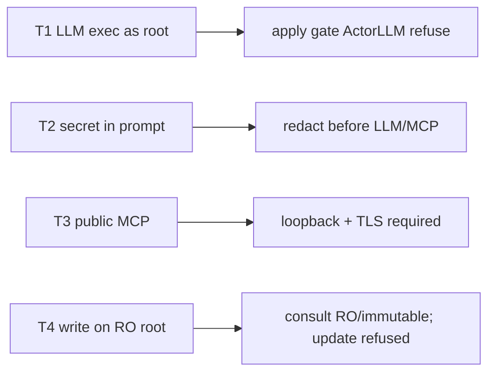

# Hawkeye — Security Threat Model

**Document ID:** HAWKEYE-0101
**Version:** 0.1.0
**Last Updated:** 2026-08-30
**Status:** ACTIVE

STRIDE focus: Tampering (apply), Information disclosure (secrets), Elevation (root exec).
