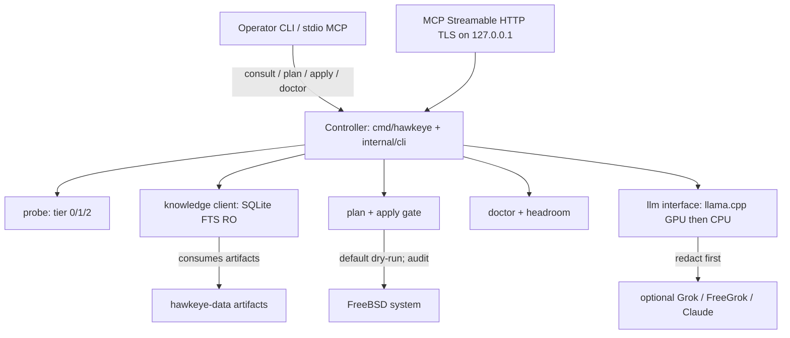
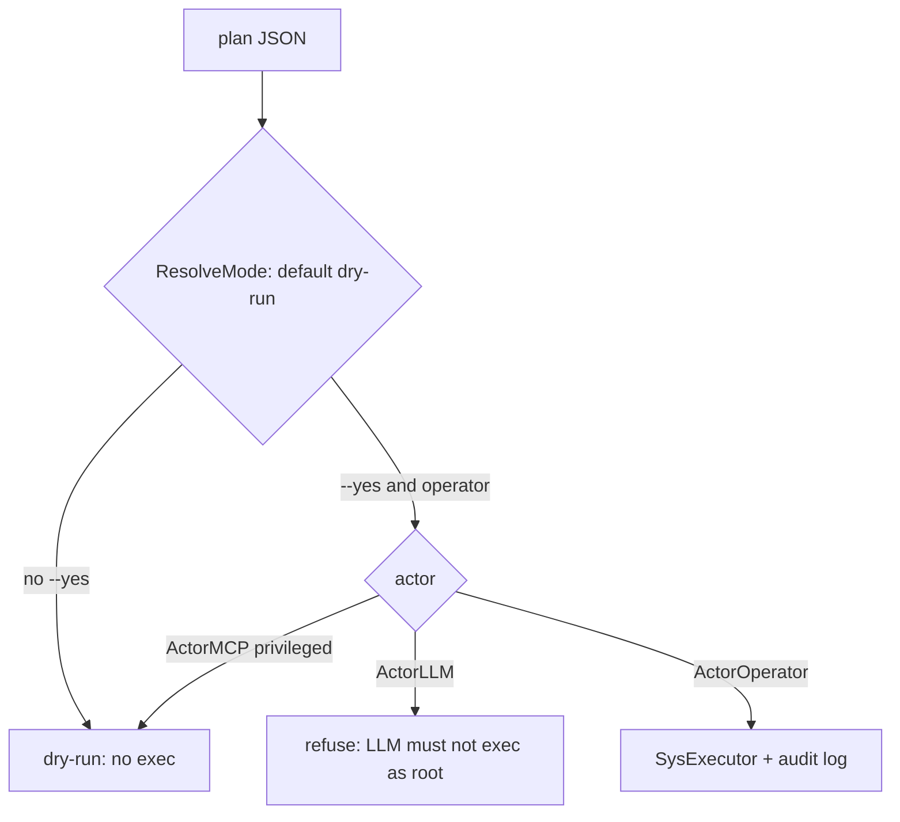
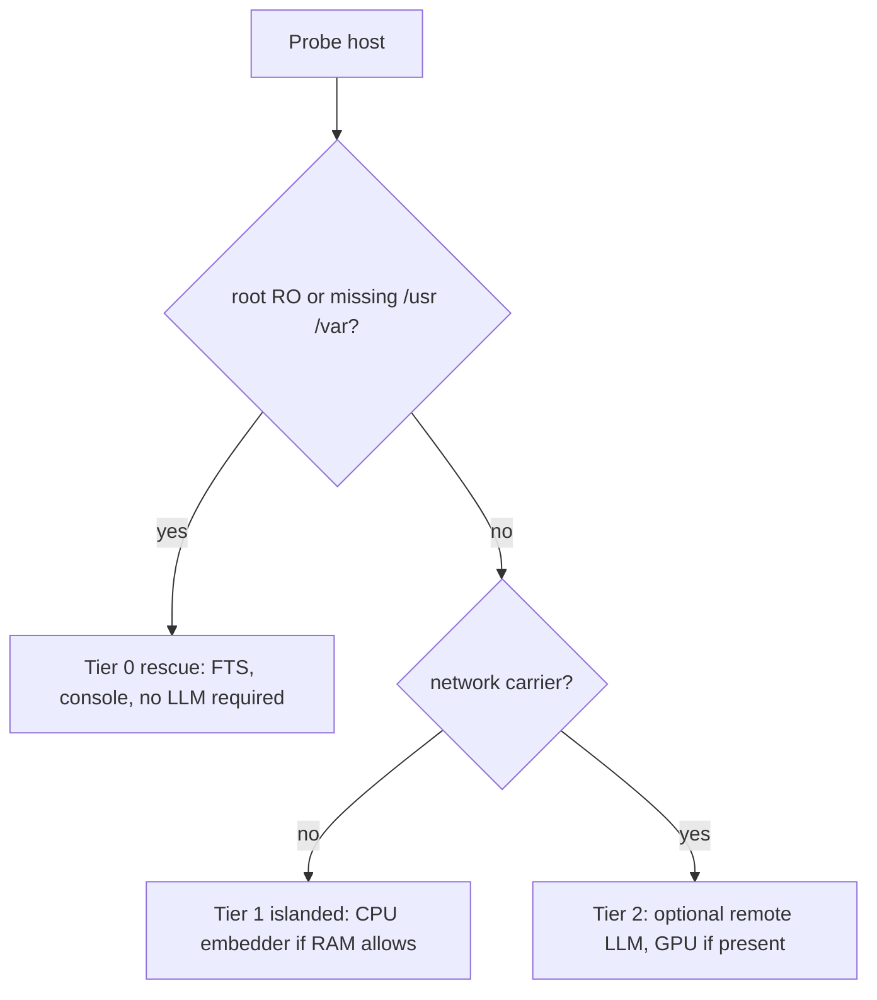

# Hawkeye architecture

**Document ID:** HAWKEYE-ARCH
**Version:** 0.1.0
**Last Updated:** 2026-08-30
**Status:** ACTIVE

This repository ships the Hawkeye **binary**. Knowledge lives in
[hawkeye-data](https://github.com/revytechinc/hawkeye-data). There is no public
chat UI.

## Layers

The UI, if any later, is a view only. This skeleton is operator CLI + MCP.
Backends bind loopback. Payloads are application DTOs; provider protocols are
never exposed. Secrets are redacted before any LLM or MCP payload.

## Apply gate

## Knowledge search order

Open is always read-only for consult. When the root is read-only, the DSN uses
`mode=ro` and `immutable=1` so SQLite will not try to create `-wal`/`-shm` files.

## Tiers

## Packages

| Package | Role |
|---------|------|
| `cmd/hawkeye` | Process entry |
| `internal/cli` | Command dispatcher |
| `internal/config` | JSON RFC 8259, XDG, `--check-config` |
| `internal/probe` | Tier classification |
| `internal/knowledge` | SQLite FTS client |
| `internal/apply` | Plan/apply gate |
| `internal/doctor` | Service health |
| `internal/headroom` | Consumption-based resources |
| `internal/llm` | Local/remote LLM interface |
| `internal/mcp` | stdio + Streamable HTTP |
| `internal/redact` | Secret scrubbing |
| `internal/audit` | Apply audit log |
| `internal/reload` | SIGHUP validate-then-swap |
